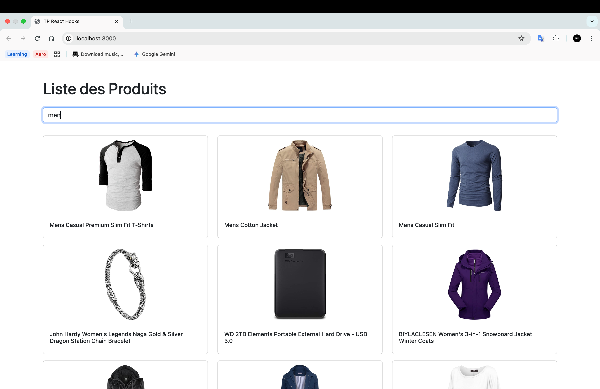

# TP React Hooks - Application de Gestion de Produits

Ce TP a pour objectif de mettre en pratique l'utilisation des Hooks React (useState, useEffect, useContext) ainsi que la création de Hooks personnalisés.

## Installation et configuration initiale

1. Cloner le dépôt :
```bash
git clone https://github.com/pr-daaif/tp-react-hooks.git
cd tp-react-hooks
```

2. Créer votre propre dépôt sur Github et changer le remote :
```bash
# Supprimer le remote origine
git remote remove origin

# Ajouter votre nouveau remote
git remote add origin https://github.com/[votre-username]/tp-react-hooks.git

# Premier push
git push -u origin main
```

3. Installer les dépendances :
```bash
npm install
```

4. Lancer l'application :
```bash
npm start
```

## Instructions pour le TP

Pour chaque exercice :
1. Lisez attentivement l'énoncé
2. Implémentez la solution
3. Testez votre implémentation (pensez à faire des copies d'écran)
4. Mettez à jour la section correspondante dans ce README avec :
   - Une brève explication de votre solution
   - Des captures d'écran montrant le fonctionnement
   - Les difficultés rencontrées et comment vous les avez résolues
5. Commitez vos changements avec un message descriptif

### Exercice 1 : État et Effets 
#### Objectif : Implémenter une recherche en temps réel

- [x] 1.1 Modifier le composant ProductSearch pour utiliser la recherche
- [x] 1.2 Implémenter le debounce sur la recherche
- [x] 1.3 Documenter votre solution ici

_Votre réponse pour l'exercice 1 :_

Pour implémenter la recherche en temps réel, j'ai utilisé deux hooks principaux de React : `useState` et `useEffect`.

1.  **Gestion de l'état** :
    * Dans `App.js`, deux états ont été créés avec `useState` : `allProducts` pour conserver la liste complète et originale des produits, et `filteredProducts` pour conserver la liste des produits à afficher, qui est mise à jour par la recherche.
    * Dans `ProductSearch.js`, un état `searchTerm` a été créé pour stocker la valeur actuelle de l'input de recherche.

2.  **Effets de bord et Debounce** :
    * Le hook `useEffect` dans `ProductSearch.js` observe les changements de la variable `searchTerm`.
    * Pour éviter de lancer une recherche à chaque frappe, une technique de **debounce** a été implémentée avec `setTimeout`. La recherche ne se déclenche que 500ms après que l'utilisateur a cessé de taper.
    * La fonction de nettoyage de `useEffect` (celle qui est `return`ée) est cruciale : elle utilise `clearTimeout` pour annuler le timer précédent chaque fois que l'utilisateur tape un nouveau caractère. Cela garantit qu'une seule recherche est effectuée à la fin.
    * Si le champ de recherche est vide, la liste complète des produits est affichée. Sinon, la liste est filtrée en fonction du `searchTerm`.

Cette approche est efficace car elle limite le nombre de re-rendus et de calculs, améliorant ainsi les performances de l'application.

**Capture d'écran du résultat :**




### Exercice 2 : Context et Internationalisation
#### Objectif : Gérer les préférences de langue

- [x] 2.1 Créer le LanguageContext
- [x] 2.2 Ajouter le sélecteur de langue
- [x] 2.3 Documenter votre solution ici

_Votre réponse pour l'exercice 2 :_

Pour gérer les préférences de langue, j'ai utilisé l'API Context de React afin de créer un état global pour l'internationalisation (i18n).

1.  **Création du Context** : Un `LanguageContext` a été créé pour stocker la langue actuelle (`fr` ou `en`), la fonction pour la modifier (`setLanguage`), et les textes traduits correspondants. Le `LanguageProvider` englobe toute l'application dans `index.js` pour rendre ce contexte accessible partout.

2.  **Traductions** : Les textes en français et en anglais ont été stockés dans des fichiers `fr.json` et `en.json` distincts pour une gestion facile.

3.  **Composant `LanguageSelector`** : Ce composant utilise le contexte via le hook personnalisé `useLanguage` pour afficher des boutons qui permettent de changer la langue. Le style des boutons se met à jour pour indiquer la langue active.

4.  **Intégration** : Les composants `App` et `ProductSearch` ont été mis à jour pour consommer le contexte. Le texte codé en dur (titre de la page, placeholder de la recherche) a été remplacé par la valeur dynamique provenant de l'objet `texts` du contexte.

Ce système permet de centraliser la logique de traduction et de changer la langue de l'application de manière efficace sans avoir à passer des props à travers de multiples niveaux de composants.

**Capture d'écran du résultat :**


### Exercice 3 : Hooks Personnalisés
#### Objectif : Créer des hooks réutilisables

- [ ] 3.1 Créer le hook useDebounce
- [ ] 3.2 Créer le hook useLocalStorage
- [ ] 3.3 Documenter votre solution ici

_Votre réponse pour l'exercice 3 :_
```
Expliquez votre solution ici
[Ajoutez vos captures d'écran]
```

### Exercice 4 : Gestion Asynchrone et Pagination
#### Objectif : Gérer le chargement et la pagination

- [ ] 4.1 Ajouter le bouton de rechargement
- [ ] 4.2 Implémenter la pagination
- [ ] 4.3 Documenter votre solution ici

_Votre réponse pour l'exercice 4 :_
```
Expliquez votre solution ici
[Ajoutez vos captures d'écran]
```

## Rendu

- Ajoutez l'URL de votre dépôt Github dans  **Classroom** et envoyer la réponse dès le démarage de votre projet.
- Les push doivent se faire au fûr et à mesure que vous avancez dans votre projet.
- Le README.md doit être à jour avec vos réponses et captures d'écran. 
- Chaques exercice doit faire l'objet d'au moins un commit avec un message mentionnant le numéro de l'exercice.